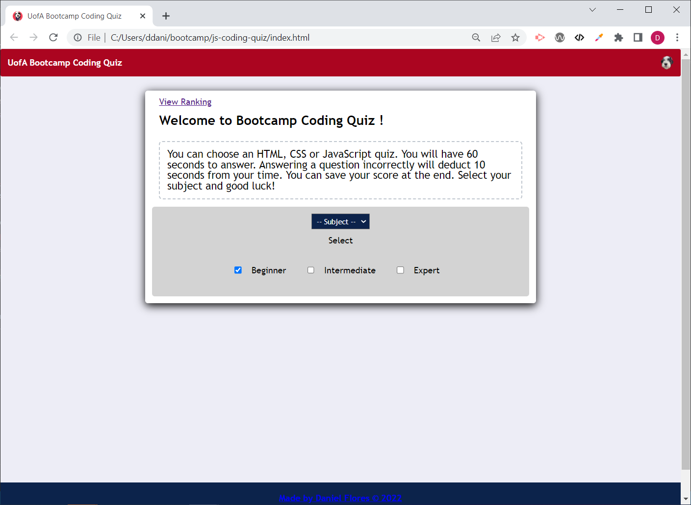
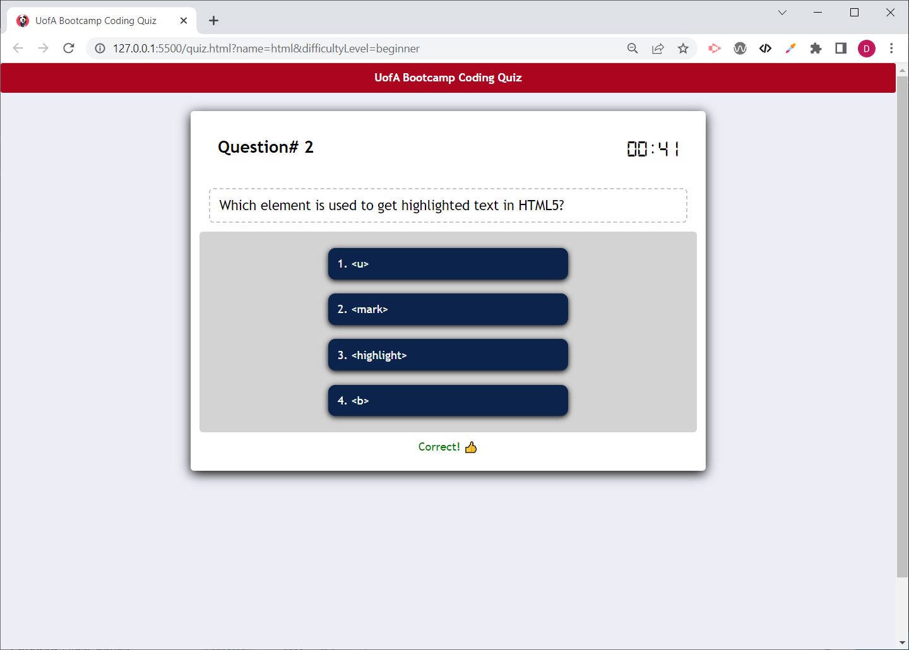
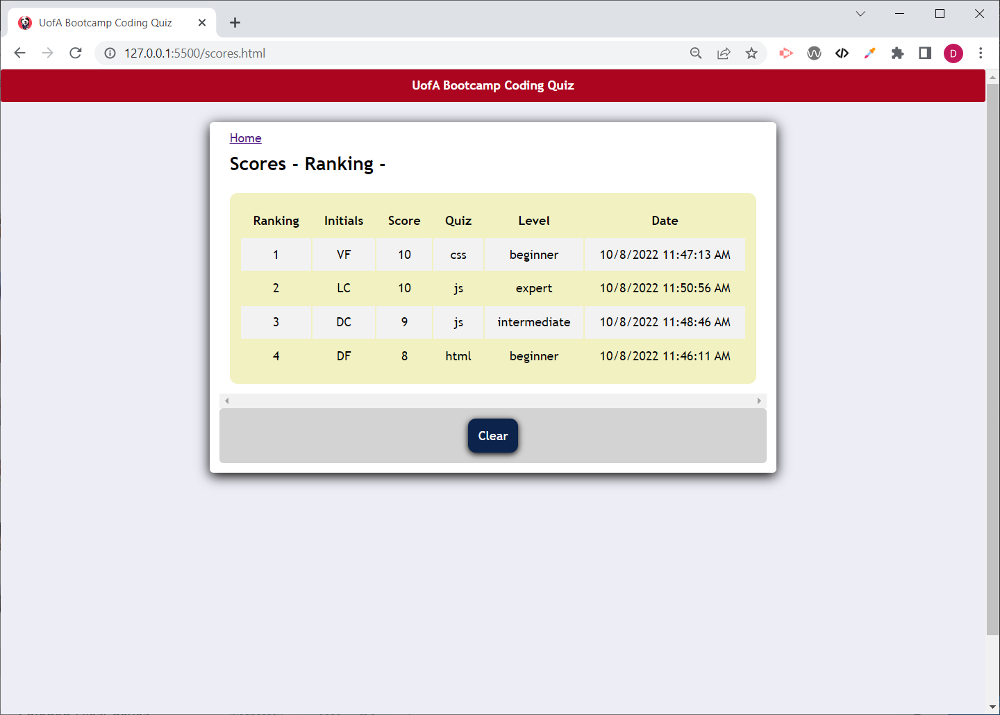

# UofA Bootcamp Coding Quiz

## Description

This project aims to implement a timed quiz web application where students can take practice JavaScript coding quizes. This application has the following features:
* Multiple quiz subjects (HTML/CSS/JavaScript).
* Difficutly levels.
* Max time per quiz depending on difficulty level.
* Number of quesitions in random order: 10 - multiple choice.
* Student score board featuring ranking, subject, difficulty level and quiz time/date.
* Student scores should be saved to local storage.
* Students can take the quiz as many times as desired.
Note: If the student answers a question incorrectly, 10s are deducted from the remaining timer.

The application is implemented using JavaScript, HTML and CSS.

## Installation
Respository can be accessed at https://github.com/danielfloresd/bootcamp-coding-quiz/. Source code direct download is located at https://github.com/danielfloresd/bootcamp-coding-quiz/archive/refs/heads/main.zip

## Usage
To view the website, please visit https://danielfloresd.github.io/bootcamp-coding-quiz/

## Credits

Started code & reset.css provided by UofA bootcamp. Quiz question courtesy of https://www.geeksforgeeks.org.

<!-- 
User Story
AS A coding boot camp student
I WANT to take a timed quiz on JavaScript fundamentals that stores high scores
SO THAT I can gauge my progress compared to my peers

Acceptance Criteria
GIVEN I am taking a code quiz
WHEN I click the start button
THEN a timer starts and I am presented with a question
WHEN I answer a question
THEN I am presented with another question
WHEN I answer a question incorrectly
THEN time is subtracted from the clock
WHEN all questions are answered or the timer reaches 0
THEN the game is over
WHEN the game is over
THEN I can save my initials and score 
-->